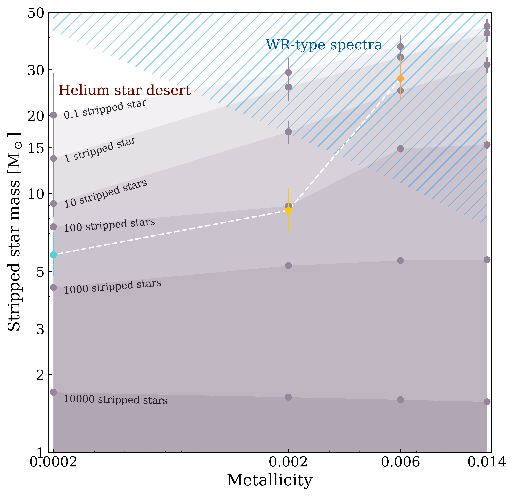

# stripped-star-distribution
Code and figures for "The Mass Distribution of Stars Stripped in Binaries: The Effect of Metallicity" ([Hovis-Afflerbach et al. 2025](https://ui.adsabs.harvard.edu/abs/2024arXiv241205356H/abstract)).



## Contents of this repository
- `data`
    - `histograms`
        - `popsynth_save_histogram.py`: creates histograms from the data in `population_synthesis_runs`. These histograms can be used to create the figures faster.
        - `hist_Z0XX.txt`: the 4 histogram files created by `popsynth_save_histogram.py`
        - `yungelson_hist.txt`: the mass distribution and cumulative distribution for $Z=0.014$ from [Yungelson et al. (2024)](https://ui.adsabs.harvard.edu/abs/2024A%26A...683A..37Y/abstract).
    - `minit_mstrip`
        - `minit_mstrip_single.txt` and `minit_mstrip_binary.txt`: the $M_{\rm init} \rightarrow M_{\rm strip}$ relation for our population synthesis code, derived from our MESA models.
        - `yungelson_minit_mstrip.txt`: the $M_{\rm init} \rightarrow M_{\rm strip}$ relation from [Yungelson et al. (2024)](https://ui.adsabs.harvard.edu/abs/2024A%26A...683A..37Y/abstract).
    - `population_synthesis_runs`: not included directly in this repository. Download the raw population synthesis results [here](https://doi.org/10.5281/zenodo.14811517) and place in this location in the file structure. (Note that all the plots except for appendix A can be produced from the histograms included here, and the full data is only needed for `appendixA_evolutionary_channels.ipynb`.)
- `figures`: contains the python scripts used to produce the figures from the paper, along with the figures.

## Dependencies
```
python 3.12.3
numpy 1.26.4
pandas 2.2.2
matplotlib 3.8.4
```